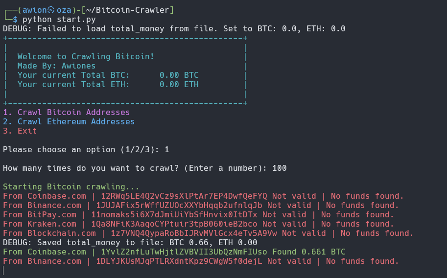

# Crawling Bitcoin & Ethereum

A Python script that simulates crawling Bitcoin and Ethereum addresses from various websites. The script generates fake cryptocurrency addresses, checks for funds, and displays the total amount collected during the crawling process.

  <!-- Replace this with the correct path to your image -->

## Features

- **Bitcoin & Ethereum Crawling**: Simulate crawling Bitcoin and Ethereum addresses with a menu-driven interface.
- **Total Funds Tracker**: Track and display the total BTC and ETH collected during crawling sessions.
- **Random Address Generation**: Simulate valid and invalid addresses from popular cryptocurrency platforms like Binance, Coinbase, Kraken, etc.
- **User-Friendly Menu**: Enjoy a simple and intuitive interface for selecting options and viewing results.
- **Data Persistence**: Automatically save and load the total BTC and ETH collected between sessions.

## Installation

```bash
git clone https://github.com/awiones/Bitcoin-Crawler.git
cd Bitcoin-Crawler
python start.py
```

## License

This project is licensed under the GPL 3.0 License. See the [LICENSE](./LICENSE) file for details.

## Contributing

Contributions are welcome! If you have suggestions, improvements, or bug fixes, please submit a pull request or open an issue.

- **Fork the Repository**: Create a personal copy of the repository on GitHub.
- **Make Changes**: Implement your changes and test them locally.
- **Submit a Pull Request**: Describe your changes and submit a pull request for review.
- 
---

Made with ❤️ by Awiones

